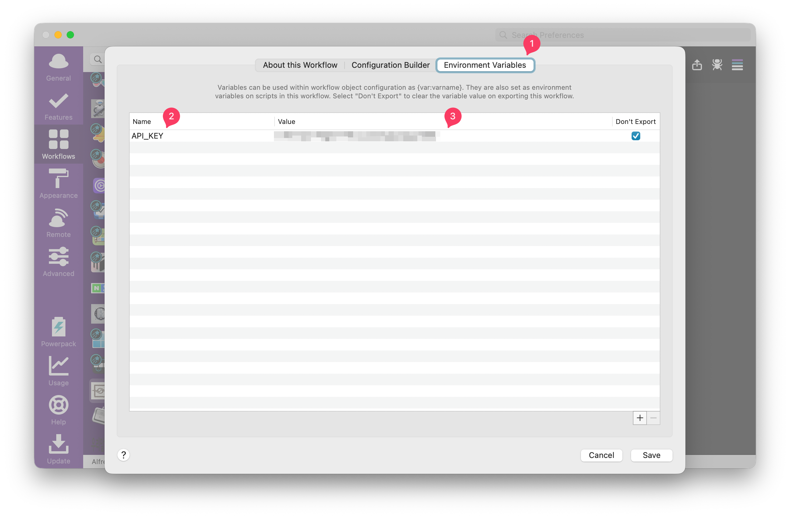

# AlfKoreanSearch : Korean Search Workflow for Alfred 
   

   

Korean Search2 Workflow for Alfred
---------------------------------

Alfred에서 [국립국어원 표준국어대사전](https://stdict.korean.go.kr/main/main.do) 검색어 자동완성 워크플로우

 

위 사이트의 OpenAPI 공식문서를 참고하였습니다.   
https://stdict.korean.go.kr/openapi/openApiInfo.do

> 이 프로젝트는 [@Kuniz](https://github.com/Kuniz)님의 [alfnaversearch 워크플로우](https://github.com/Kuniz/alfnaversearch)를 기반으로 구현하였습니다.  

   

**필수 준비사항 - API key**  
[오픈 API 사용 신청 | 국립국어원 표준국어대사전](https://stdict.korean.go.kr/openapi/openApiRegister.do)에서 API key를 발급받아야 정상적으로 이용할 수 있습니다.  

--------

   

Install workflow
--------------

- [releases](../../releases/latest) 페이지의 `AlfKorean2Search.alfredworkflow`를 다운로드 받아서 실행한다.

- MacOS 12.3 이상의 경우
  - python3 설치
    - `brew install python`
    - `xcode-select --install`

- Alfred 4.0 이상 지원
- Python 2 사용 불가

### API key 입력

  

알프레드 워크플로우의 해당 워크플로우 설정 화면 - Environment Variables 탭에서,  
위 이미지와 같이 Name 칸에는 `API_KEY`, 그리고 Value 칸에는 발급받은 API key값을 입력합니다.  

정확하게 입력하지 않으면 에러가 날 수 있습니다.  

General Usage
--------------
* `kk ...`  : 검색어 입력 (연관검색어가 나열됨)  
* **Cmd + Y** : 검색결과를 미리 보기(웹브라우져 출력)

트리거가 되는 키워드`kk`는 Alfred-workflow-AlfKorean2Search 에서 개인에 맞게 직접 수정할 수 있습니다. 

Externel Module
--------------
 This workflow used alfred-workflow more than v0.0.2. Alfred-workflow can find there(https://github.com/deanishe/alfred-workflow).
 This workflow used alp(A Python Module for Alfred Workflows) module at v0.0.1. It created by Daniel Shannon. 
 Certifi : using ssl with default urllib

LICENSE
--------------
 - MIT
