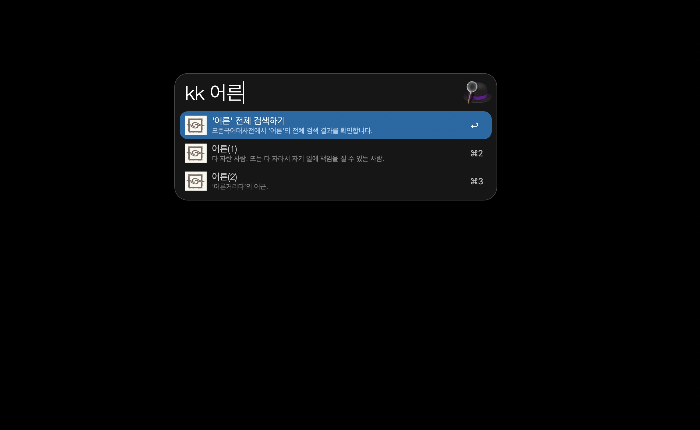
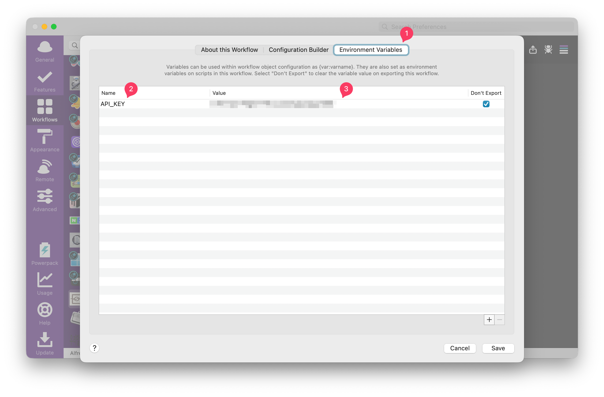

# AlfKorean2Search : 표준국어대사전 검색 Workflow for Alfred
   

   


표준국어대사전 검색 Workflow for Alfred
---------------------------------

Alfred에서 [국립국어원 표준국어대사전](https://stdict.korean.go.kr/main/main.do) 검색 목록 워크플로우  

주의! 검색어 자동완성 기능이 아닙니다.  
Alfred에서 해당 웹사이트에 있는 검색어와 그 뜻을 보여줍니다.  
목록에서 `enter`를 누르면 해당 검색어의 url로 연결됩니다.  

<br>

위 사이트의 OpenAPI 공식문서를 참고하였습니다.   
https://stdict.korean.go.kr/openapi/openApiInfo.do

> 이 프로젝트는 [@Kuniz](https://github.com/Kuniz)님의 [alfnaversearch 워크플로우](https://github.com/Kuniz/alfnaversearch)를 기반으로 구현하였습니다.  
> 이전 Python 구현을 Go로 재작성하였으며, 별도의 런타임 설치 없이 동작합니다.

<br>  

**필수 준비사항 - API key**  
[오픈 API 사용 신청 | 국립국어원 표준국어대사전](https://stdict.korean.go.kr/openapi/openApiRegister.do)에서 API key를 발급받아야 정상적으로 이용할 수 있습니다.  

<br>  

--------
## Preview

  

<br>  

Install workflow
--------------

- [releases](../../releases/latest) 페이지의 `AlfKorean2Search.alfredworkflow`를 다운로드 받아서 실행한다.

- 지원 환경
  - Alfred 5 이상 (Powerpack 필요)
  - macOS (Apple Silicon · Intel 겸용 universal 바이너리로 배포)
  - **별도의 Python 등 런타임 설치가 필요 없습니다.** 워크플로우에 포함된 단일 실행 파일로 동작합니다.

> 배포 바이너리는 ad-hoc 서명되어 있으며, 최초 실행 시 워크플로우의 `run` 스크립트가 다운로드 격리(quarantine) 속성을 제거하여 Gatekeeper 경고 없이 실행됩니다.

### API key 입력

  

알프레드 워크플로우의 해당 워크플로우 설정 화면 - Environment Variables 탭에서,  
위 이미지와 같이 Name 칸에는 `API_KEY`, 그리고 Value 칸에는 발급받은 API key값을 입력합니다.  

정확하게 입력하지 않으면 에러가 날 수 있습니다.  

General Usage
--------------
* `kk ...`  : 검색어 입력 (검색어와 뜻풀이 목록이 나열됨)  
* **Cmd + Y** : 검색결과를 미리 보기(웹브라우져 출력)

트리거가 되는 키워드 `kk`는 Alfred 워크플로우 설정에서 개인에 맞게 직접 수정할 수 있습니다.

자동 업데이트: 새 버전이 릴리스되면 주 1회 백그라운드로 확인하여, 검색 목록 상단에 업데이트 안내를 표시합니다.

Development
--------------
Go로 작성되었습니다.

```sh
go test ./...      # 테스트 실행
go vet ./...       # 정적 분석
sh ./make.sh       # 워크플로우 패키징 (macOS, lipo·codesign 필요)
```

구조

- `cmd/koreansearch` : Alfred Script Filter 진입점 (단일 universal 바이너리)
- `internal/handlers` : 표준국어대사전 OpenAPI 호출 및 파싱
- `internal/alfred` · `cache` · `httpx` · `urlx` · `update` : 워크플로우 인프라

LICENSE
--------------
 - MIT
